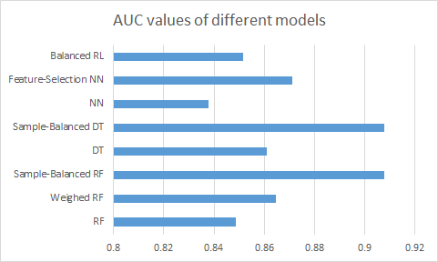

# 5G User Prediction Experiment Dataset and Solutions

## Overview

The "World Internet Development Report 2022" released during the Wuzhen Summit of the World Internet Conference 2022 showed that the number of global 5G users increased by 70 million in the first quarter of 2022, reaching approximately 620 million, with a 5G population coverage rate exceeding 25%.

According to predictions by Ericsson and the Global System for Mobile Communications Association (GSMA), the number of global 5G users will surpass 1 billion by the end of 2022.

For telecommunications operators, facing such a vast 5G market, it is extremely helpful to build user profiles based on certain user-side information and further target potential 5G users with precision marketing.

## Dataset Overview

This dataset is used for the 5G user prediction experiment and contains 59 feature columns, with one column being the target variable (`target`) indicating whether the user is a 5G user. The dataset is characterized by an extremely unbalanced distribution of the target variable, with a ratio of approximately 74:1 for non-5G users (`target=0`) to 5G users (`target=1`). To protect user privacy, all variables have been renamed according to their type, with categorical variables named as cat_xx and numerical variables as num_xx. Therefore, The dataset includes 20 categorical variables (`cat_0` to `cat_19`) and 39 numerical variables (`num_0` to `num_38`).

## Evaluation

The evaluation criterion is AUC, where a higher score indicates better performance.

## Solutions

To address the dataset's imbalance and improve prediction accuracy, we employed the following models and strategies:

### Random Forest (RF)

- Original Data Training: Train directly with the original data to obtain preliminary results.
- Weighted Processing: Set weights for each category based on the distribution of the target variable and retrain the model.
- Sample Balance Processing: Undersample the training data to make the distribution of 0 and 1 roughly equal before training.

### Decision Tree (DT)

- Feature Selection: Select features based on the degree of dispersion of each variable's values in the sample.
- Sample Balance Processing: Undersample the training data on the basis of feature selection to make the distribution of 0 and 1 roughly equal before training.

### Neural Network (NN)

- Random Feature Selection: Randomly select ten categorical features and perform one-hot encoding for learning.
- Selection Based on Feature Importance: Select key features based on the feature importance from random forests and decision trees for training.

### Logistic Regression (LR)

- Weighted Processing: Weights were set for the target variable to address the data imbalance issue.

## Results

Through the above solutions, we achieved the following experimental results:

- Random Forest: The AUC value was improved through weighted and sampling processing, ultimately reaching 0.9077.
- Decision Tree: The AUC value was improved through feature selection and sampling processing, ultimately reaching 0.9077.
- Neural Network: The AUC value was improved from 0.8378 to 0.8711 through random feature selection and selection based on feature importance.
- Logistic Regression: After data normalization and weight setting, the AUC value was 0.8515.

## Conclusion

Due to the dataset's class imbalance and mixed data types, we employed different strategies for each model. For random forests and decision trees, we tried weighted and sampling processing to address class imbalance. For neural networks, we used feature selection to reduce overfitting and improve model performance.

With these solutions, we were able to effectively enhance the predictive accuracy of the models and provide a viable solution for the 5G user prediction problem.
